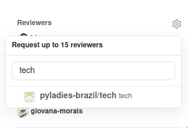
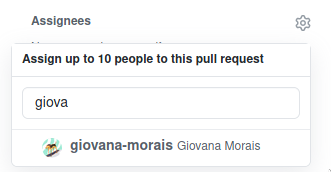
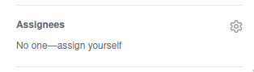
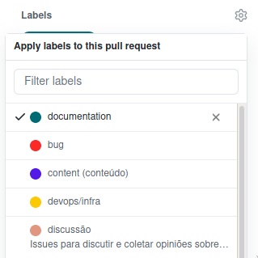

Menu
====
0. Aviso sobre a Síndrome do Impostor
1. Primeiros Passos
  * [Contribuindo](#contribuindo)
  * [Preparando o ambiente local](#preparando-o-ambiente-local)

2. Criando e Adicionando
  * [Criar um novo post](#criar-um-novo-post)
  * [Adicionar nova localização](#adicionar-nova-localização)
  * [Adicionar vídeos](#adicionar-vídeos)

3. Deploy
  * [Fazendo o Pull Request](#fazendo-o-pull-request)
  * [Atualizando o site](#atualizando-o-site)

Aviso sobre Síndrome do Impostor
============

A gente precisa da sua ajuda. Sério!

Pode ser que haja uma vozinha na sua cabeça dizendo que você não está pronta;
que você precisa fazer mais um tutorial ou aprender mais um framework, talvez
escrever mais algumas postagens no seu blog antes de conseguir nos ajudar com
esse projeto.

Ignora essa voz. A gente te garante que esse não é o caso.

Tentamos deixar esse guia de contribuição o mais claro possível, mas este é um
documento vivo, então qualquer dúvida, basta abrir uma [issue](https://github.com/pyladies-brazil/br-pyladies-pelican/issues/new/choose)
e seguiremos melhorando!

Como você verá no decorrer do documento, nem toda contribuição é feita código. Você
pode contribuir por meio de postagens, ideias e discussões, adicionando o
evento do seu capítulo, adicionando o seu capítulo e etc.

Esse pequeno aviso foi traduzido [desse repositório](https://github.com/adriennefriend/imposter-syndrome-disclaimer).

Obrigada por contribuir!


Contribuindo
============

1. Faça o fork do projeto
2. Clone o projeto para a sua máquina `git clone https://github.com/<seu_usuario>/br-pyladies-pelican.git`
3. Crie uma branch para a feature em que trabalhará: `git checkout -b minha-nova-feature`
4. Faça commit das suas alterações: `git commit -m 'Adiciona alguma feature'`
5. Faça push desses commits para sua branch: `git push origin minha-nova-feature`
6. Envie um pull request para o nosso repositório

**Observação**: Nós usamos português como linguagem padrão dos commits.


Atualizando o fork
------------------

Caso você não tenha mais o projeto em seu computador:

0. Clone o projeto para a sua máquina `git clone https://github.com/<seu_usuario>/br-pyladies-pelican.git`

Com o projeto no seu computador:

1. Adicione um novo remote: `git remote add upstream https://github.com/pyladies-brazil/br-pyladies-pelican`
2. Obtenha todas as branches deste novo remote: `git fetch upstream`
3. Certifique-se de que você está na branch master: `git checkout master`
4. Atualize sua branch master, unindo seus commits (que não estão no projeto original) ao projeto atualizado: `git rebase upstream/master`
5. Atualize seu fork no GitHub: `git push origin master`

**Observação**: Se for a primeira vez que você faz rebase, talvez precise usar o "-f": `git push -f origin master`

Preparando o ambiente local
--------------------------
- Antes de mais nada, verifique se você tem o **Python 3.6.4** instalado na sua máquina.

Para criar um `virtualenv` e instalar os pacotes necessários para rodar o projeto,
siga as orientações do capítulo "Instalando e Rodando" do [README](https://github.com/pyladies-brazil/br-pyladies-pelican/blob/master/README.md)

Criar um novo Post
------------------

#### Linux

Para criar um novo post, rode o comando:

`make newpost NAME='NOME DO SEU POST`

Ele irá criar um novo arquivo `nome-do-seu-post.md` na pasta `content`
e abrirá seu editor favorito com um conteúdo pré-adicionado.
Você só precisará adicionar o restante do conteúdo.

Após terminar o post, renderize-o com o comando `pelican content`

Se tudo deu certo, seu novo post já estará disponível na página.

#### Windows

Caso o Makefile não funcione, você pode criar o seu post manualmente!
Vá até a pasta `content` e abra um arquivo de texto. O nome do arquivo
deve seguir o padrão `YYYY-MM-DD-nome-da-sua-postagem.md`, por exemplo,
`2020-10-22-como-fazer-um-novo-post.md`.

Após abrir o arquivo de texto, insira o seguinte cabeçalho no início
```raw
title: <seu título>
date: <data da postagem>
category: <categoria do seu post>
tags:
comments: true
author: <seu nome!>
```

Depois disso, é só escrever a sua postagem!

**Observação**: Os arquivos são formatados como `Markdown`, então
talvez seja interessante fazer uma busca simples pra ver como colocar
elementos básicos como títulos, links e até trechos de código.

Criar uma nova Página
---------------------

Para criar uma nova página, rode o comando:

	make newpage NAME='NOME PAGINA'

Ele irá criar um novo arquivo `nome-pagina.md` na pasta `content/pages` e abrirá seu editor favorito com um conteúdo pré-adicionado.  Você só precisará adicionar o restante do conteúdo.

Após terminar de editar a página, renderize-a com o comando:

	pelican content

Se tudo deu certo, sua página já estará disponível em `/slug-pagina/`.


Adicionar nova Localização
--------------------------

Para adicionar uma nova localização de grupo de pyladies, edite o arquivo `data/locations.yml`. O formato é o seguinte:


```yaml
- city: Cidade
  state: Estado
  created_month: Abreviação do mês de fundação
  created_year: Ano de fundação com 04 dígitos
  status: Ativo ou Inativo
  image: /images/locais/PYLADIES_CIDADE.png
  facebook: URL completa da página do facebook (rede social opcional)
  github: URL completa do github (rede social opcional)
  instagram: URL completa do instagram (rede social opcional)
  linkedin: URL completa dO linkedin (rede social opcional)
  twitter: URL completa do twitter (rede social opcional)
  youtube: URL completa para o canal do Youtube (rede social opcional)
  twitch: URL completa para o canal do Twitch (rede social opcional)
  email: E-mail oficial do capítulo (@pyladies.com)
  url: Site oficial do capítulo (pyladies.com) (opcional)
  lat: latitude da cidade/estado do seu capítulo (opcional, mas altamente recomendado, caso contrário será gerado automaticamente)
  lon: longitude da cidade/estado do seu capítulo (opcional, mas altamente recomendado, caso contrário será gerado automaticamente)
```

**Atenção:** A imagem precisa ter o tamanho de `100px x 100px` e ser no formato .png

O arquivo está em ordem alfabética, então insere o teu capítulo levando isso em consideração, tá?!


Adicionar vídeos
----------------

Para adicionar um novo vídeo verifique qual categoria o vídeo irá se encaixar: Depoimentos, Dojos, Palestras ou Tutoriais, edite o arquivo correspondente a categoria que você escolheu `data/videos_depo.yml`,`data/videos_dojos.yml`,`data/videos_talks.yml` ou `data/videos_tutorials.yml` com o nome do vídeo e seu link. Ele possui o seguinte formato:

```yaml
- # Nome do Vídeo
  url: //www.youtube.com/embed/XXXXXXXXXXX
```

**Atenção:** O link do vídeo é aquele que se encontra na aba de incorporamento do youtube e não na de compartilhamento:


**Lembre-se** de colocar como comentário o título do vídeo antes do link:


Editar Layout
-------------

O site PyLadies utiliza um framework CSS chamado [Foundation](http://foundation.zurb.com/sites.html). Antes de escrever estilos para algo em particular, recomendamos verificar se o framework não oferece a funcionalidade ou estilo desejado, bastando que seja aplicada uma classe específica ao HTML.


Fazendo o Pull Request
-----

Na hora de fazer o pull request é bem legal você prestar atenção em
algumas pontos:
* Definimos que nosso padrão de código é em português, então se possível se lembre de manter
tanto as mensagens de commit quando o próprio título do Pull Request em português
* Marque o time de tecnologia para que seu PR seja revisado mais rapidamente!
Pra fazer isso, vá até o canto direito da sua tela no momento em que estiver
abrindo o PR, clique na engrenagem ao lado do título _Reviewers_ e digite
`tech-team`. Ao aparecer o ícone, clique nele.


* Se coloque como _assignee_ da tarefa. Dessa forma as notificações chegam pra
você mais rápido. Pra fazer isso, clique na engrenagem ao lado do nome _Assignees_
e procure pelo seu usuário do github **ou** clique em _assign yourself_.



* Coloque uma _label_ no seu PR. Dependendo da sua modificação, temos labels
diferentes, veja a que melhor se encaixa com as modificações que você está
propondo no PR. As mais comuns são `content (conteúdo)`, `documentation` e
`enhancement`.

* Agora você está mais do que pronta pra submeter o seu PR pra gente revisar!


Atualizando o site
------------------

Todo pull-request aberto para o branch `master` irá disparar uma série de automações que checam a integridade do site e geram uma preview dele.
Além disso, o time responsável por manter o site será marcado para revisar as mudanças propostas.

Para verificar se suas mudanças estão da forma que você espera, basta verificar o status check de deploy preview, clicar em detalhes e você vai ser redirecionada para um site com as suas mudanças.

Se estiver tudo certo, basta esperar que alguém revise e integre seu pull-request em `master`, o que vai disparar um deploy automático para o ambiente de produção, também conhecido como [nosso site](http://brasil.pyladies.com/).

