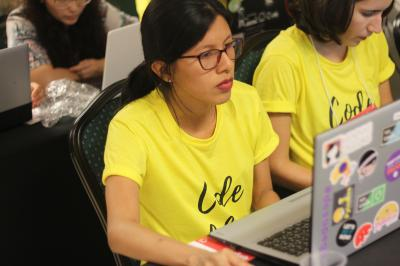
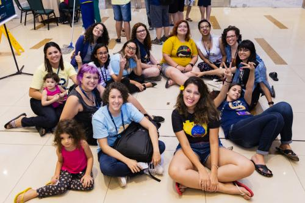
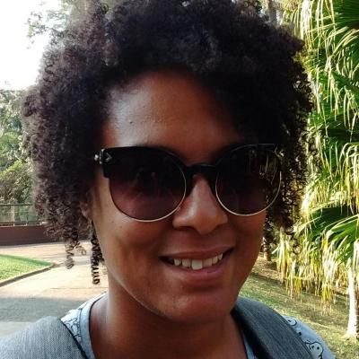
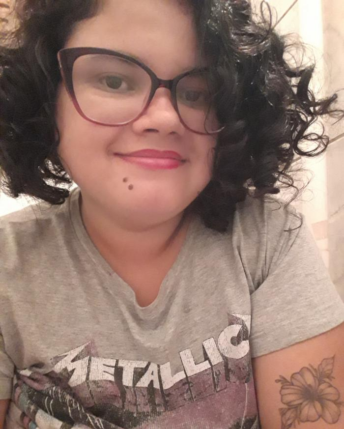

Title: "Nós agradecemos a você... <3"
Slug: nos-agradecemos-a-voce
Date: 2019-09-28 19:38:42
Tags: Institucional
author: PyLadies Brasil
comments: true

Estamos em setembro, quase outubro, e mais uma Python Brasil se aproxima. Mas não poderíamos de deixar de agradecer a você, pessoa, que contribuiu para a participação das PyLadies na PyBR[14]. E como esse evento proporcionou coisas incríveis, até inimagináveis.

A Python Brasil não é só a maior conferência de Python da América Latina, mas também um ambiente de encontros e reencontros. Ela proporciona descobertas, fascínios, e laços que se estendem para a vida. Foram tantos acontecimentos: desde estudantes dos IF's que aprenderam a programar no evento e apresentaram seus projetos, até uma sala lotada de gente, para ouvir mulheres falando sobre essa iniciativa chamada <b>PyLadies</b>.

Foi o encontro mais cheio até agora. Com <b>784</b> inscritos, <b>153</b> eram mulheres, sendo <b>20%</b> delas palestrantes e <b>24%</b> participantes. Isso é um avanço muito representativo, tanto para o PyLadies em si, como para toda a comunidade. 

E o que é mais peculiar nessa comunidade tão querida é o quanto as pessoas se doam e se dedicam ao que acreditam. Todas as vezes que passava pelos corredores do evento, eu via grupos se ajudando. Via humildade, carisma e principalmente solidariedade com o próximo. Se pudesse reduzir esse sentimento em uma palavra, com certeza ela seria <i>altruísmo</i>, definida no dicionário como "Ausência do egoísmo".

O PyLadies, que tem por objetivo a promoção de diversidade na área de tecnologia, vem efetivamente encorajando mulheres a serem participantes ativas e líderes na comunidade Python, compartilhando e adquirindo seus conhecimentos. Para que isso se torne possível em todos os âmbitos é necessário apoio e suporte, para que haja cada vez mais inclusão e diversidade em cenários como a Python Brasil. Por conta disso, há quatro anos uma campanha de financiamento coletivo é realizada, com o foco de oferecer auxílio a ladies que não possuem condições financeiras de participar do evento.
Ano passado foram <b>10</b> mulheres levadas por essa campanha. Esse ano, o objetivo é levar <b>15</b>. E para alcançarmos essa meta, precisamos da sua ajuda! Acesse a [<b>Campanha do PyLadies na Python Brasil[15]</b>](http://bit.ly/campanhapyladies15) e contribua!

A você que contribuiu com a nossa campanha de 2018, o nosso **muito obrigada**! É extremamente importante ter esse suporte da comunidade para que relatos como esse continuem acontecendo. Confira os depoimentos de algumas das beneficiadas pela última campanha:

<figure class="quote">
    
    <figcaption>
        <blockquote>A PyBR14 foi a primeira conferência Python a nível nacional que tive a oportunidade de participar. Sou muito grata à companha das PyLadies por ter me dado a oportunidade de comparecer ao evento. Lá tive contato com outras pessoas da comunidade e vi de perto o quão acolhedora ela é. Foi muito bom conhecer pessoas de diversas partes do Brasil e com vivências diferentes, pude aprender bastante com elas. Tive insights para fomentar a comunidade Python aqui em Manaus/AM e desde então estamos realizamos eventos seguindo como parâmetro a Python Brasil. Desejo que outras mulheres tenham acesso à campanha, possam comparecer e saiam de lá com as energias renovadas assim como aconteceu comigo. Não é só um evento de tecnologia, mas também um encontro de amizades. <3</blockquote>
        <h5>Juliany Rayol  - Manaus, Amazônia </h5>
    </figcaption>
</figure>
<figure class="quote">
    
    <figcaption>
        <blockquote>Essa foto representa um pouquinho da minha felicidade. Pude participar da Python Brasil[14], através da Campanha das PyLadies Brasil, e esse foi o melhor presente que poderia ganhar no ano todinho. Eu ficava sorrindo igual boba, sabe? Parecia criança quando ganha brinquedo ao invés de roupas no natal.
 
Se pudesse definir a experiência de estar no evento, usaria a seguinte palavra: transformadora. Foi **transformador** ter a possibilidade de viajar para um estado que nunca fui, poder participar da conferência pela primeira vez, e ser tão bem acolhida pela comunidade pythônica. Foi **transformador** ter pessoas que admiro ali do meu lado, conversando comigo de igual para igual, e mostrando o real sentido da comunidade. Foi transformador subir ao palco num evento tão grande, e poder palestrar sem medo, falando sobre a iniciativa que eu mais amo no mundo: o PyLadies. É **transformador** ver o quanto isso impactou na minha vida, e como me abriu portas. 

Hoje, quero proporcionar isso para outras PyLadies, porque sei o quão **transformador** pode ser na vida de alguém participar de um evento desses.</blockquote>
        <h5>Letícia Silva - São José dos Campos, SP</h5>  
    </figcaption>
</figure>
<figure class="quote">
    
    <figcaption>
        <blockquote>Foi uma experiencia **INCRÍVEL**. Nunca havia participado de algo tão grandioso relacionado a tecnologia, até então só ia a encontros locais. Foi sensacional poder conhecer muita gente nova, poder conversar com gente que eu admirava só nas redes, compartilhar experiências e aprender MUITO. Foi lá também meu contato pessoalmente com a AfroPython e a partir daí pude iniciar o capítulo Recife. Depois da pyBR só aconteceram coisas ótimas na minha vida profissional, sou muito grata por poder ter participado. Obrigada a quem tornou tudo isso possível!<3</blockquote>
        <h5>Anicely Santos - Recife, PE</h5>
    </figcaption>
</figure>
<figure class="quote">
    
    <figcaption>
        <blockquote>Como iniciante na área de TI participar de eventos como a Python Brasil é um momento enriquecedor, em 2018 tive contato com desenvolvedorx de diversos ramos, vivências que nunca imaginei na minha primeira PyBR. A experiência do evento deu um novo rumo para minha vida acadêmica e profissional, novas perspectivas de crescimento. E sem dúvida alguma, sem a ajuda fiananceira da campanha realizada pelo Pyladies BR, não teria vivido esse momento, a iniciativa para financiamento de pyladies de todos os cantos do país é a maior demonstração de empatia e crescimento dessa comunidade. Com o dinheiro arrecadado consegui pagar passagens e me manter na cidade, não deixe de contribuir, além de brindes exclusivos, você e toda a comunidade, ganha com a participação feminina no mercado.</blockquote>
        <h5>Ana Maria Gomes - Teresina, PI</h5>
    </figcaption>
</figure>

  

Muitíssimo obrigada a todos vocês, 

Ademar Peixoto - Biguá

Alexandre Yukio Harano

Bianca Rosa

Fernando Masanori Ashikaga

Gustavo Coelho

Ítalo Rossi

Janaina Centini

Lucas Magnum

Marco Antônio Rougeth de Oliveira

Otávio Carneiro

Pedro Baesse Alves Pereira

Abner Paulo Campanhã

Alexandre B A Villares

Alexandre Yukio Harano

Aline Bastos Pinto

Alynne Ferreira Sousa

Alysson Mendes de Oliveira

Ana Clara Nobre Mendes

Ana Paula Gomes

Bianca Rosa de Mendonça

Carlos Pereira von Sohsten

Cássio Oliveira Botaro

Cezar Sá Espinola

Cintia Lumi Tho

Cristina Motinha Martins

Darlene Medeiros

Diego Liberalquino Soares Lima

Douglas Antonio Rodrigues Silva

Eduardo Mendes

Evolux Sistemas

Felipe dos Santos de Morais

Fernanda Pereira da Silva

Fernando Masanori

Gabriel Ecker

Gabriela Bezerra

Gustavo Soares Fernandes Coelho

Igor dos Santos Silva

Isis Soledad

Ítalo Rossi Batista Cocentino

Jonatas Baldin de Oliveira

Juan Funez Gutierrez

Julio Andre Biason

Letícia da Silva Rosa

Lucas Marques de Castro

Marcel Ribeiro Dantas

Marcelo Pereira Silva

Marco Rougeth

Maria Fernanda Barbosa Wanderley

Mário Sérgio Oliveira de Queiroz

Moises Maia Gomes

Monica Magalhães Pereira

Otávio Carneiro dos Santos

Patrick da Silveira Porto

Philippi Sedir Grilo de Morais

Rogério Jurado Munhoz

Ryllari Raianne Marques de Santana

Talita de Souza Rossari

Thaissa Bueno Sanches

Thrycia Viviane Gadelha Macena Oliveira

Tulio Casagrande Alberto

Vanessa Sayuri Uchida

Wêdja Suely Alves Pereira

Paula Grangeiro

Aline Cristine

Anderson Casimiro

Anderson Philip

Andrei Agdo

Ariane Alves

Bruna Nayara Moreira Lima

Bruno Cintra

Cláudia SM

Daniel de Aguiar

Davi Marcondes Moreira

Ederson Brilhante

Elena Martinis

Flavia Cunha

Gustavo Castilião

Igor Leroy

Jhonny Michel

João Garcia

João Vítor Marquim Ferraz Nogueira

Juliana Amoasei dos Reis

Leticia Monteiro

LILIAN MENDONCA DE MOURA

Luis Claudio Dias dos Santos

Maira Teixeira de Melo

Maria Fernanda Barbosa Wanderley

Mariah Queiroz Costa Silva

mariana oliveira

Mariana Tiemi Kavashita

Milena Crivella Veríssimo

Patrícia Yuri Urushima de Azevedo

Risla Lopes Miranda

Sabrina Lima

Ubiratã Carvalho

Veridiana Farias

Vivian Macedo

Yan Falcão

e também a todas que preferiram não se identificar. Vocês são demais, gratidão! ♡ 

